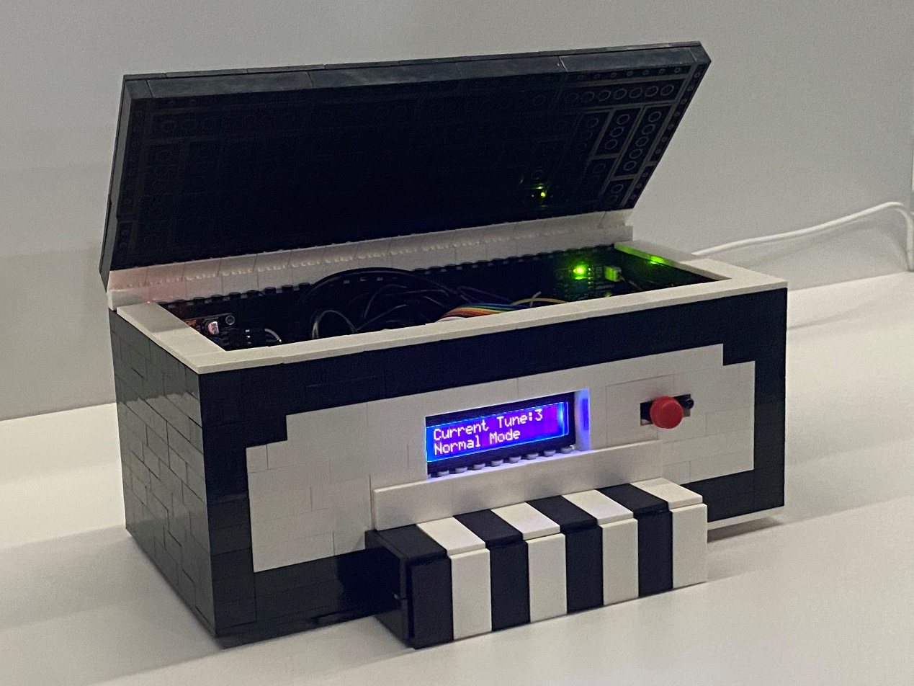
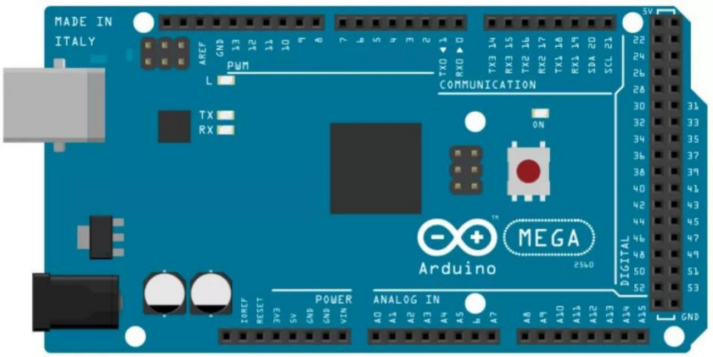
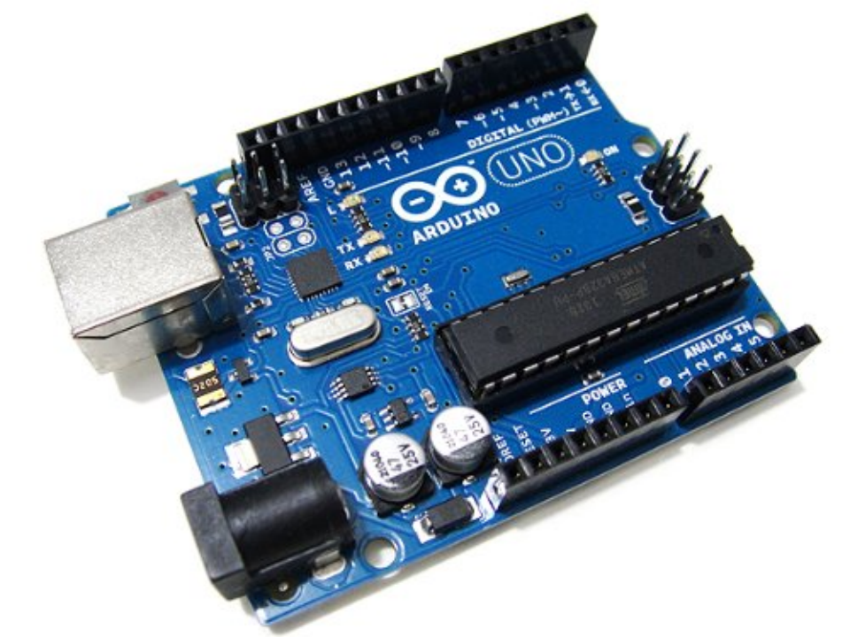
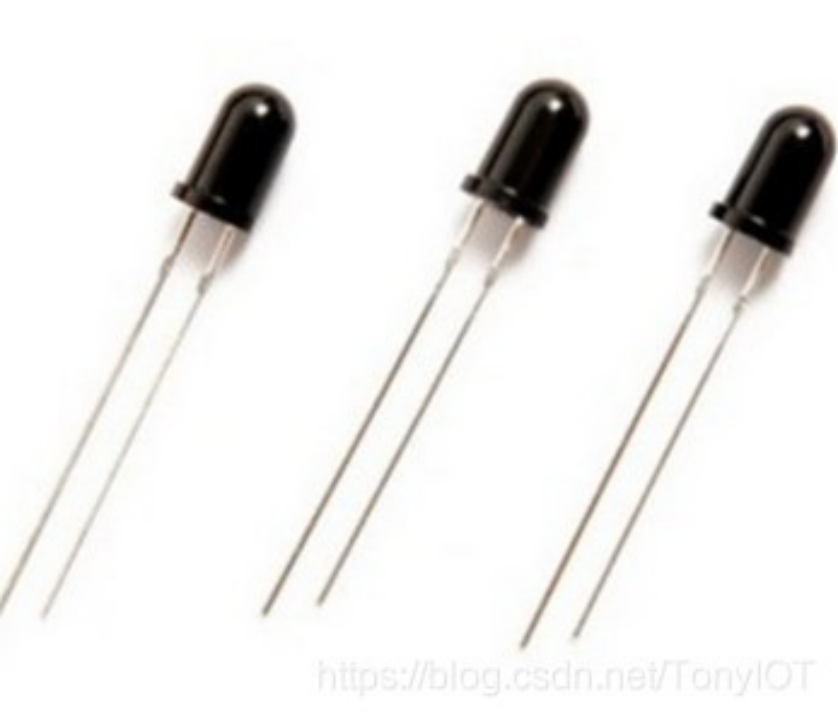
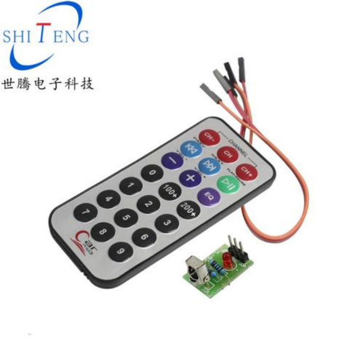
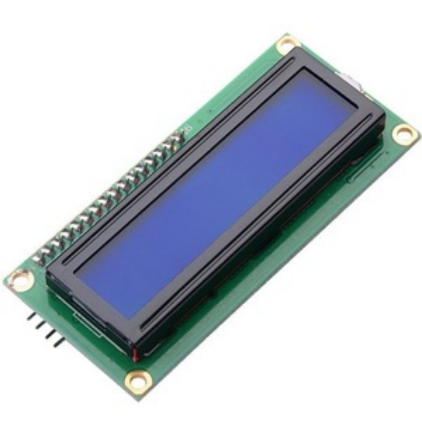
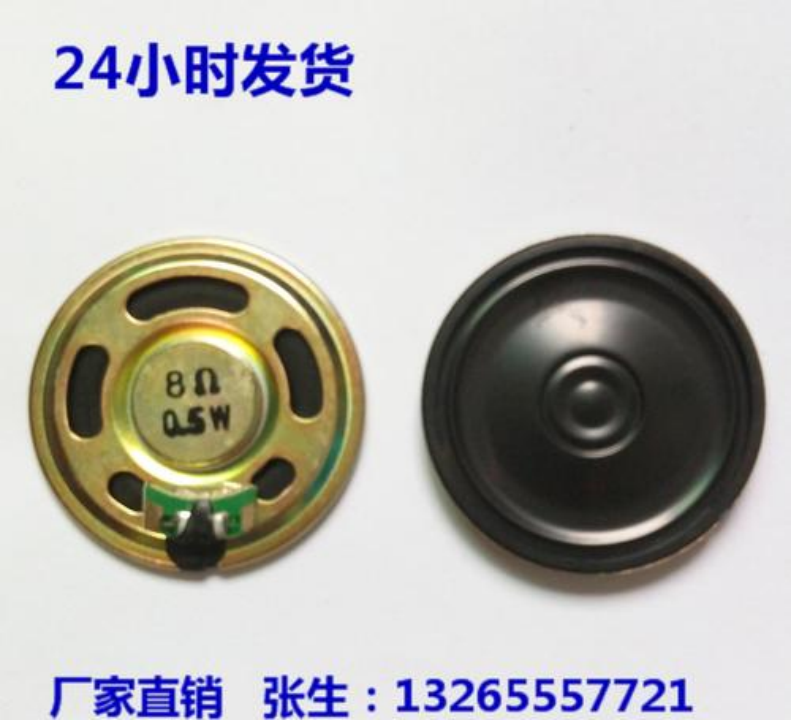

# 小学期 - 基于Arduino的电子琴设计

## 主要功能

利用一块Arduino Mega与一块Arduino Uno合并设计一台电子琴。该电子琴采用按键+功放的原理，并且搭配遥控器模块进行功能调节，搭配显视频可以查看电子琴状态。另外有一个彩蛋，火焰传感器识别火焰自动播放生日快乐歌，该电子琴可以作为生日礼物！

## 原件介绍

***a. Arduino Mega board*** 

 

Our group uses Arduino Mega board to realize the basic functions of electronic organ without using chord. The Mega board has many ports, so we can use it to achieve more functions than the UNO board.

 

***b. Arduino Uno board***

 

We use uno board to realize chord function. It can play the second chord and automatically play the chord accompaniment of ‘happy birthday’.

 

***c. Flame sensor***

 

When a candle gets close to the flame sensor, ‘happy birthday’ will be played automatically.

 

***d. Remote control module***

 

 

We use the remote control to realize the function of changing tone, changing mode and playing music automatically. These functions are integrated into a remote control, which is very convenient for users to operate.

 

***e. LCD1602 display screen***

 

This display screen is used to show the current mode and tune and the note being played. And it can also display the name of the song being played.

 

***f. Loudspeaker***

 

The loudspeaker is to make the sound of the electronic organ loud enough for people to hear.

 

## 功能设计

***1.Switch on / off***

We have a switch button to control the power source. If press the button, the piano will open up with an opening notice sound, and LCD lighted up. If press the button again, the piano will shun down with a closing notice sound, and LCD turned off.

 

***2.Eight notes***

We have eight keys to play eight different tunes (from Do to Do#). 

 

***3.Tune change***

We have infrared remote controller component to switch 5 different pitch zones. If press the “CH+” on the controller, the tune which keys play increases a octave. If press the “CH-” on the controller, the tune which keys play decreases a octave. If press the “CH” on the controller, the tune come back to the origin, which is the 3rd out of 5 pitch zones. All the three operations have corresponding notice sound.

 

***4.Varied modes***

We have different playing patterns for the keys. By using the infrared remote controller, we can switch back and forth between shaking, tremolo and tiktok and normal modes.

 

***5.Diphonia***

Our electronic organ supports two keys to be pressed and sounded at the same time, which makes the playing more flexible. When the player presses a key and starts to play the next note, if the previous key is not raised, the occurrence of the next sound will not be affected, so that the performance can be more fluent.

 

***6.Automatically play***

The electronic organ has an automatic playing mode. Music can be played by using the digital key of the remote controllor. We create two modes of automatic music -- the Skipping Mode and the Learning Mode. The music supported skipping consists of Astronomia and Cannon(1, 2at the remote controllor). The Skipping Mode is to press any piano key for a period of time. The songs supporting the Learning mode are the Theme Song of the Smiling Proud Wanderer, the Little White Boat, the theme song of game Fight the Landlord game and the Theme Song of Doraemon(3, 4, 5, 6at the remote controllor) . The using method of the Learning mode is that the user can still play the music when the music is played. The user needs to press any key to enable learning mode (this step is to prevent keyboard noise during auto-playing), while pressing the key, the rest of the keys can be played. Users can learn the songs in the automatic playing, or try the random accompaniment of harmony.

 

***7.Happy Birthday Song***

For someone's birthday, give them an electronic organ and **light up** a birthday song based on candles. All you have to do is hold the candle close to the sensor on the right side of the head of the electronic organ, which will automatically play the birthday song. Come and share your friends a wonderful moment! 

 

***8.LCD***

LCD display can display the name of the sound being played, display the sound area, can display playing mode (Shaking, Tremolo, TikTok and Normal), display the song playing automatically. LCD provides friendly reminder for users. Users can know the status of their electronic organ, which makes it easier to be played.

 